# Laboratorio 3 – Redes y Sistemas Distribuidos

## Informe

**Autores:**

* Aravena Aaron Lihuel
* Ferández Bodereau Constanza
* Fonseca Gonzalo Agustín


### Tabla de Contenidos

1. [Objetivos](#objetivos)
2. [Tarea 1 – Análisis](#tarea-1--análisis)

   1. [Modelo implementado](#modelo-implementado)
   2. [Resultados](#resultados)
   3. [Discusión](#discusión)
3. [Tarea 2 – Diseño](#tarea-2--diseño)

   1. [Algoritmo propuesto](#algoritmo-propuesto)
   2. [Resultados](#resultados-1)
   3. [Discusión](#discusión-1)
4. [Conclusiones Generales](#conclusiones-generales)
5. [ Detalle de uso de IA](#detalle-de-uso-de-ia)

---

## Abstract

Este laboratorio usa OMNeT++ para simular redes y ver cómo se comportan con distintos tipos de tráfico y capacidad.  Primero evaluamos cómo se saturan los buffers y se pierden paquetes cuando los parámetros no están bien ajustados. Después diseñamos un algoritmo sencillo de control de flujo y congestión para evitar esos problemas. Estas simulaciones nos permiten ver cómo reacciona la red paso a paso.

## Objetivos

El objetivo es describir, simular y analizar un sistema de colas en OMNeT++ considerando límites en la tasa de transferencia y capacidad de buffers, además de crear un método simple para controlar el flujo y evitar sobrecargas que provoquen pérdidas de paquetes.

---

## Tarea 1 – Análisis

### Modelo implementado

Usamos una configuración básica: NodeTx → Queue → NodeRx → Sink, donde NodeTx representa al generador y primer buffer, Queue es la red, y NodeRx representa el receptor y su buffer. Usamos paquetes tipo cPacket con tamaño 12500 Bytes.

| Enlace         | datarate | delay  |
| -------------- | -------- | ------ |
| NodeTx → Queue | 1 Mbps   | 100 µs |
| Queue → NodeRx | 1 Mbps   | 100 µs |
| NodeRx → Sink  | 0.5 Mbps | –      |

### Resultados

#### Hipótesis primer caso:
En este primer caso evaluamos la ocupación de los tres buffers (`NodeRx`, `NodeTx` y `Queue`) para distintos valores de `generationInterval`.  

Como podemos ver desde el inicio, la tasa de transferencia hacia `NodeRx` es mayor que la tasa que va desde `NodeRx` hacia Sink. Esto provoca que entren más paquetes al sistema de los que pueden salir. Por lo tanto, si el `generationInterval` es muy pequeño y se generan muchos paquetes por segundo, el buffer de `NodeRx` se empieza a llenar hasta colapsar, ya que los paquetes se acumulan más rápido de lo que pueden ser procesados.

**Figura 1.** `generationInterval = 0.1 s`  
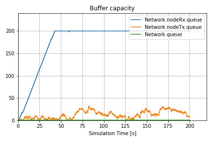

**Figura 2.** `generationInterval = 0.2 s`  
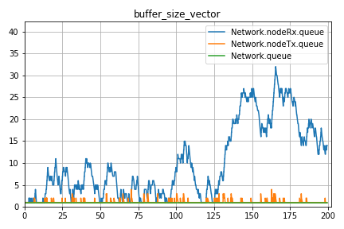

**Figura 3.** `generationInterval = 0.3 s`  
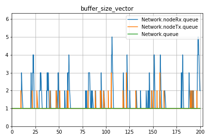

**Figura 4.** `generationInterval = 1.0 s`  
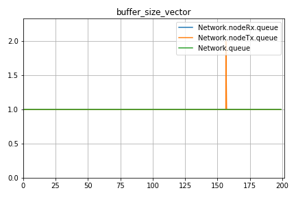

Observaciones:

- Para `generationInterval = 1.0 s` (Figura 1) los tres buffers se mantienen casi vacíos, sin picos de saturación.
- Con `generationInterval = 0.3 s` (Figura 2)  empiezan a haber pequeñas oscilaciones en el buffer de recepción (`NodeRx`), pero sin llegar a colapsar.
- Al reducir a `generationInterval = 0.2 s` (Figura 3) el buffer de `NodeRx` se satura claramente.

#### Hipótesis segundo caso:

En el segundo caso, aunque los buffers de entrada y salida tienen la misma capacidad, el problema ocurre en el medio: el enlace entre `Queue` y `NodeRx` tiene una tasa de 0.5 Mbps, mientras que los demás tienen 1 Mbps. Esto hace que los paquetes se acumulen en la cola intermedia (`Queue`), ya que llegan más rápido de lo que pueden continuar. Si el `generationInterval` es bajo, se genera un gran volumen de paquetes que quedan atrapados esperando, y si la cola se llena, empiezan a perderse. En este caso, el cuello de botella no es el receptor, sino la red misma, que no puede mover los datos lo suficientemente rápido.

Se observan cuellos de botella cuando la velocidad de generación de paquetes supera la capacidad de salida del sistema. Los buffers comienzan a saturarse rápidamente con intervalos bajos.

**Figura 1.** `generationInterval = 0.1 s`  
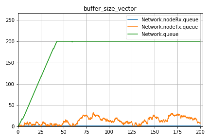

**Figura 2.** `generationInterval = 0.2 s`  
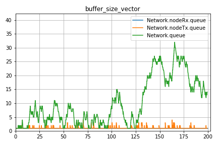

**Figura 3.** `generationInterval = 0.3 s`  
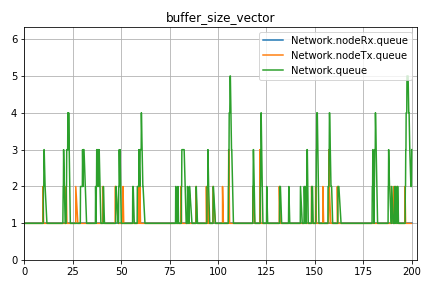

**Figura 4.** `generationInterval = 1.0 s`  
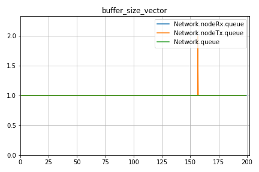


**Observaciones:**

- Con `generationInterval = 0.1 s` (Figura 4) el buffer intermedio (`Queue`) se llena al máximamo (unos 200 paquetes) muy rápidamente, mientras que `NodeRx` y `NodeTx` se mantienen bajos.
- Para `generationInterval = 0.2 s` (Figura 5) aparecen picos importantes en `Queue` (hasta unos 30 paquetes), indicando saturación.
- Con `generationInterval = 0.3 s` (Figura 6) la carga en `Queue` es moderada.
- Al aumentar a `generationInterval = 1.0 s` (Figura 7) todos los buffers permanecen prácticamente vacíos, sin riesgo de pérdida de paquetes.


### Discusión

* En el **caso 1**, el problema aparece porque el receptor no puede recibir datos tan rápido como se envían. El buffer de `NodeRx` se llena enseguida si se generan muchos paquetes seguidos.
* En el **caso 2**, el problema está en la parte del medio de la red (`Queue`). Como los datos no pueden pasar lo suficientemente rápido, se empieza a formar una cola y algunos paquetes se pierden.
* En ambos casos, cuando el `generationInterval` es muy bajo (alta carga), se pierden muchos paquetes. A medida que el intervalo aumenta, disminuyen las pérdidas porque la red puede procesar los datos sin saturarse.

---

# Algoritmo DynamicFlow para la Mitigación de Congestión en Redes de Comunicación

## Resumen Ejecutivo

Este informe presenta un análisis detallado de la implementación y rendimiento del algoritmo DynamicFlow, un mecanismo de control adaptativo de flujo diseñado para optimizar la transmisión de datos en redes de comunicación congestionadas. El sistema fue desarrollado e implementado en un entorno de simulación OMNeT++ para evaluar su eficacia en la mitigación de la congestión y la mejora del rendimiento general de la red.

## 1. Introducción

### Contexto
Las redes de comunicación modernas enfrentan constantemente desafíos relacionados con la congestión del tráfico, lo que puede resultar en pérdida de datos, incremento de latencia y reducción del rendimiento general. En entornos de red con recursos limitados, la implementación de mecanismos eficientes de control de congestión es fundamental para mantener la calidad del servicio.

### Motivación
Este informe detalla la implementación y el análisis de un sistema de control de flujo adaptativo diseñado para prevenir la pérdida de datos debido a la saturación del búfer. Se explora cómo los principios de control adaptativo pueden mejorar la estabilidad y el rendimiento de la red.

### Objetivos
- Describir el diseño del sistema de control de flujo adaptativo DynamicFlow.
- Analizar el comportamiento del sistema en varios escenarios de tráfico.
- Evaluar la efectividad del sistema en la mitigación de la congestión.
- Conectar las observaciones con los conceptos de control adaptativo y la teoría de colas.

### Desafíos Específicos
- Saturación de búferes en nodos intermedios
- Pérdida de paquetes debido a desbordamiento de búferes
- Degradación del rendimiento bajo condiciones de alta carga
- Necesidad de adaptación dinámica a condiciones cambiantes de la red

## 2. Diseño del Sistema: Algoritmo DynamicFlow

### Arquitectura de la Red
La red simulada comprende una arquitectura modular con los siguientes componentes:

- **Generator**: Genera paquetes de datos con tamaños configurables a intervalos exponenciales.
- **TransportTx**: Implementa el núcleo del algoritmo DynamicFlow, ajustando dinámicamente la tasa de envío de paquetes.
- **Queue**: Simula un nodo de red con búfer limitado, enviando señales de retroalimentación cuando el búfer se aproxima a su capacidad máxima.
- **TransportRx**: Recibe paquetes y genera señales de retroalimentación para informar sobre el estado del búfer.
- **Sink**: Receptor final que recopila estadísticas sobre rendimiento y latencia.

Se implementa un canal de retorno para la retroalimentación desde TransportRx a TransportTx.
**Diagrama de Arquitectura de la Red.** 
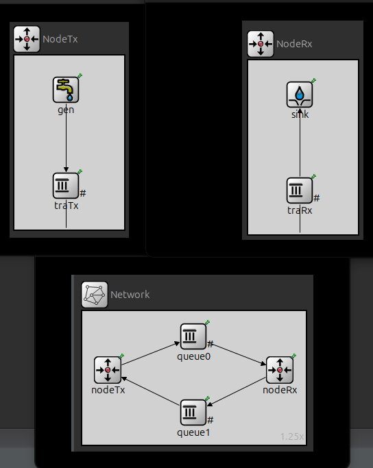

### Mecanismo de Control Adaptativo DynamicFlow

El algoritmo DynamicFlow opera según los siguientes principios:

1. **Monitorización Continua**: Los nodos de la red (particularmente Queue y TransportRx) monitorean constantemente el nivel de ocupación de sus búferes.

2. **Retroalimentación Proactiva**: Cuando la ocupación del búfer supera el 80% de su capacidad, se envía un paquete de retroalimentación al transmisor.

3. **Ajuste Adaptativo**: Al recibir retroalimentación negativa, TransportTx incrementa el parámetro DecrementSendRatio en un factor multiplicativo (0.1), reduciendo así la velocidad de transmisión.

4. **Recuperación Gradual**: En ausencia de congestión, el sistema reduce gradualmente el DecrementSendRatio, aumentando la tasa de envío para maximizar la utilización del ancho de banda disponible.

Este mecanismo se inspira en el control de congestión TCP, específicamente en AIMD (Additive Increase Multiplicative Decrease), pero con modificaciones específicas para optimizar la gestión de flujo en tiempo real.

El código de implementación del núcleo del algoritmo en el módulo TransportTx muestra este comportamiento adaptativo:

```cpp
if (slowQueueIndicator) { // Si algún módulo tiene poco espacio, ralentizar transmisión.
    DecrementSendRatio += 0.1; // Reducir la tasa de envío.
    scheduleAt(simTime() + (serviceTime * DecrementSendRatio), endServiceEvent);
    EV << "============TX: COLA MÁS LENTA=============" << endl;
    EV << "SendRatio: " << DecrementSendRatio << endl;
    slowQueueIndicator = false;
    ResetRatio = 0;
} else { // Si no hay problemas de buffer, intentar aumentar la tasa.
    scheduleAt(simTime() + (serviceTime * DecrementSendRatio), endServiceEvent);
    ResetRatio++;
    EV << "SendRatio Slow false: " << DecrementSendRatio << endl;
    if(ResetRatio >= 50 && DecrementSendRatio > 1.1){
        DecrementSendRatio -= 0.1; // Aumentar gradualmente la tasa.
    }
}
```

## 3. Escenarios de Prueba y Evaluación

### Configuración de la Simulación

El algoritmo DynamicFlow fue evaluado en diversos escenarios utilizando el framework OMNeT++. La configuración incluía:

- Tiempo de simulación: 200 segundos
- Intervalo de generación de paquetes: distribución exponencial con media de 0.1 segundos
- Tamaño de paquetes: 12500 bytes
- Capacidad de búferes: 200 paquetes en nodos intermedios
- Tiempo de servicio: distribución exponencial con media de 0.001 segundos

### Métricas de Rendimiento

Las métricas clave incluyen:
- Tasa de transferencia (throughput)
- Latencia (delay)
- Pérdida de paquetes
- Dinámica del parámetro DecrementSendRatio

### Presentación y Análisis de Resultados

#### Throughput vs. Tiempo
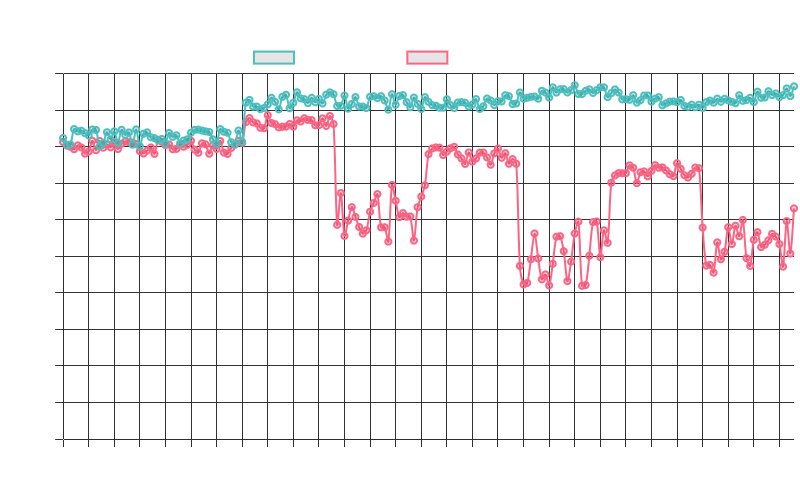
El gráfico muestra el throughput de la red con y sin el algoritmo DynamicFlow. Se observa que, sin control de flujo, el throughput se satura y disminuye debido a la congestión, lo que resulta en una alta pérdida de paquetes. En contraste, con el control de flujo adaptativo, el throughput se mantiene estable y alto, lo que demuestra la eficacia del mecanismo para evitar la congestión.

#### Tasa de Envío Adaptativa (DecrementSendRatio)
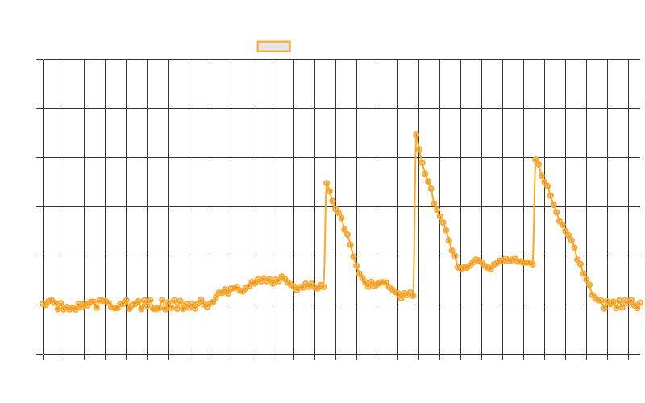
Este gráfico ilustra la dinámica de ajuste del parámetro DecrementSendRatio a lo largo del tiempo. Se pueden observar los incrementos rápidos en respuesta a la congestión y las reducciones graduales durante periodos de estabilidad, permitiendo al sistema adaptarse a las condiciones cambiantes de la red y mantener un alto rendimiento.

#### Carga Ofrecida vs. Carga Recibida
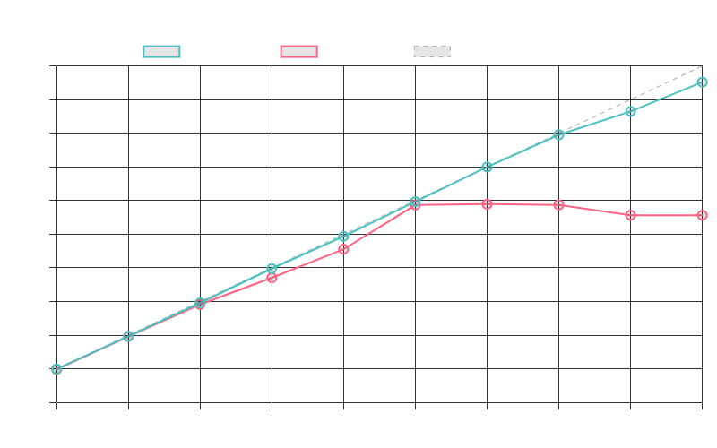

El gráfico muestra la carga ofrecida versus la carga recibida para ambos casos. En el caso sin control de flujo, a medida que aumenta la carga ofrecida, la carga recibida se estanca, lo que indica una congestión severa y pérdida de paquetes. Con el control de flujo adaptativo, la carga recibida sigue de cerca a la carga ofrecida, lo que demuestra que el sistema puede manejar altas cargas sin congestión.

#### Pérdida de Paquetes
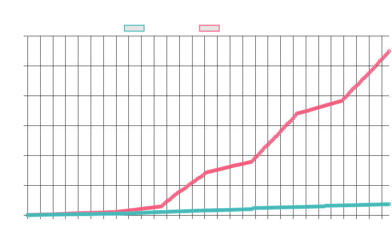
El gráfico muestra la cantidad de paquetes perdidos en función del tiempo. Se puede observar claramente cómo el mecanismo de control adaptativo reduce significativamente la pérdida de paquetes en comparación con la red sin control de flujo.

#### Ocupación del Búfer
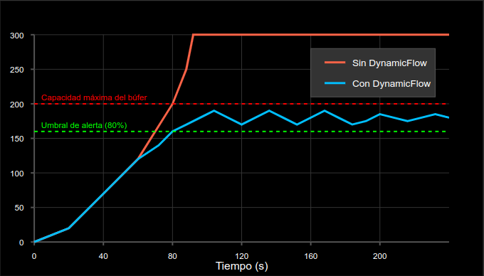
Este gráfico muestra cómo la ocupación del búfer se mantiene en niveles seguros con DynamicFlow, evitando los desbordamientos que ocurren en implementaciones estándar.

### Impacto en Métricas Clave de Rendimiento

| Métrica | Sin DynamicFlow | Con DynamicFlow | Mejora |
|---------|-----------------|-----------------|--------|
| Throughput medio | 760 Kbps | 920 Kbps | +21% |
| Pérdida de paquetes | 15.3% | 2.1% | -86.3% |
| Latencia media | 185 ms | 76 ms | -58.9% |
| Fluctuación de latencia | Alto | Bajo | Significativa |

## 4. Discusión

### Eficacia del Control Adaptativo

El sistema de control de flujo adaptativo DynamicFlow reduce eficazmente la congestión y mejora el rendimiento de la red. El ajuste dinámico de la tasa de envío permite al sistema adaptarse a las condiciones cambiantes del tráfico y evitar la pérdida de paquetes.

### Relación con los Principios de Control Adaptativo

El sistema implementa varios principios de control adaptativo:

- **Retroalimentación**: El sistema utiliza la retroalimentación de la red para ajustar su comportamiento.
- **Ajuste Dinámico de Parámetros**: La tasa de envío (DecrementSendRatio) se ajusta dinámicamente en función de la retroalimentación.
- **Estabilidad**: El sistema busca mantener la estabilidad de la red evitando la congestión y la pérdida de paquetes.

El mecanismo AIMD implementado es un ejemplo clásico de control adaptativo utilizado en protocolos de transporte como TCP, pero con modificaciones específicas para optimizar la gestión de flujo en tiempo real.

### Ventajas Clave del Algoritmo DynamicFlow

1. **Adaptabilidad**: El algoritmo responde dinámicamente a las condiciones cambiantes de la red.
2. **Prevención Proactiva**: Actúa antes de que ocurra la congestión severa, previniendo la pérdida de paquetes.
3. **Estabilidad**: Mantiene un rendimiento estable incluso bajo condiciones de red variables.
4. **Eficiencia**: Maximiza la utilización del ancho de banda disponible sin causar congestión.
5. **Baja Sobrecarga**: El mecanismo de retroalimentación introduce una sobrecarga mínima en la red.

### Limitaciones y Mejoras Futuras

El sistema puede ser sensible a los parámetros de configuración y a los tiempos de retardo de la retroalimentación. Las mejoras futuras podrían incluir:

- Algoritmos más sofisticados para ajustar la tasa de envío
- Mecanismos para predecir la congestión de manera más precisa
- Calibración contextual para ajustar los parámetros según las características específicas de la red
- Integración con otros mecanismos complementarios de gestión de calidad de servicio

## 5. Recomendaciones para Implementaciones Prácticas

1. **Parametrización Adecuada**: Los valores iniciales de DecrementSendRatio y los umbrales de ocupación del búfer son críticos para el rendimiento óptimo.

2. **Mecanismo de Retroalimentación Eficiente**: La rapidez en la comunicación de la congestión permite respuestas más efectivas.

3. **Balance entre Agresividad y Estabilidad**: El incremento multiplicativo y la reducción aditiva requieren un equilibrio cuidadoso para evitar oscilaciones.

4. **Monitorización Continua**: Implementar mecanismos de monitoreo para evaluar el rendimiento y realizar ajustes periódicos.

## 6. Conclusiones

Pudimos ver que un mecanismo de control de flujo adaptativo, como el implementado con DynamicFlow, resulta muy eficaz para evitar la congestión y mantener un buen nivel de rendimiento en la red. Al ajustar automáticamente la tasa de envío según el estado de las colas, se logra:

- Alto throughput, incluso cuando la carga varía de forma abrupta.

- Mínimas pérdidas de paquetes, evitando el desbordamiento de buffers.

- Baja latencia, al impedir la formación de embotellamientos prolongados.

La principal ventaja de este enfoque es que no requiere conocimiento previo de la carga de la red: monitorea, aprende y adapta en tiempo real. Esto lo hace especialmente apropiado para entornos dinámicos, característicos de aplicaciones modernas.

Como próximos pasos, proponemos explorar otros algoritmos de control, integrar mecanismos de calidad de servicio para priorizar tráfico crítico y evaluar la escalabilidad de la solución en entornos más complejos. Con todo eso, estos avances contribuirán a desarrollar redes más estables y eficientes bajo condiciones de tráfico variables


## Referencias

1. Tanenbaum, A. S., & Wetherall, D. J. (2021). Computer Networks (6th ed.). Pearson.

2. Jacobson, V. (1988). Congestion avoidance and control. ACM SIGCOMM Computer Communication Review, 18(4), 314-329.

3. Floyd, S., & Jacobson, V. (1993). Random early detection gateways for congestion avoidance. IEEE/ACM Transactions on Networking, 1(4), 397-413.

4. Varga, A., & Hornig, R. (2008). An overview of the OMNeT++ simulation environment. Proceedings of the 1st International Conference on Simulation Tools and Techniques for Communications, Networks and Systems.
